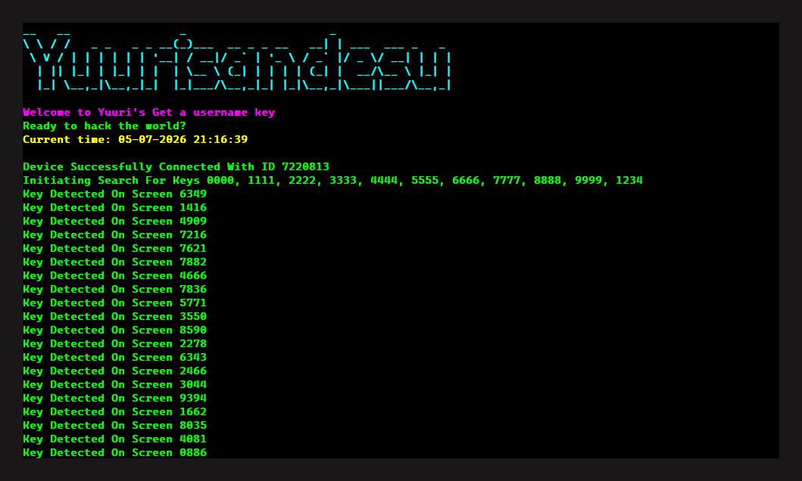

<div align="center">


<p>
  
  
  
  
</p>

<p>
  <b>WhatsApp Key Bot</b> is a CLI automation tool that searches for a specific WhatsApp username key using ADB and OCR.<br/>
  It captures the phone screen via ADB, reads the displayed 4-digit key using EasyOCR, and automatically taps Generate until the target key appears. When found, it taps Save and optionally saves a screenshot. ADB platform tools are downloaded automatically if not present.<br/>
  Built and distributed by <b>Yuurisandesu</b>.
</p>

</div>

---

<div align="center">
  
</div>

---

## Table of Contents

- [Requirements](#requirements)
- [Before You Start](#before-you-start)
- [Installation](#installation)
- [Usage](#usage)
- [Flags](#flags)
- [Features](#features)
- [File Structure](#file-structure)
- [Disclaimer](#disclaimer)

---

## Requirements

- Python `3.12`
- A USB cable
- USB Debugging enabled on your Android phone
- WhatsApp open on the username key page on your phone

---

## Before You Start

Before running the bot, make sure the following conditions are met:

1. Your phone is connected to your PC via USB cable
2. USB Debugging is enabled on your phone. Go to Settings, then About Phone, tap Build Number 7 times to unlock Developer Options, then go to Developer Options and enable USB Debugging
3. When prompted on your phone to allow USB Debugging from this computer, tap Allow
4. WhatsApp is open and you are on the username key page. This is the screen where a 4-digit key is displayed with a Generate and Save button
5. Your phone screen must stay on and unlocked while the bot is running

ADB platform tools are downloaded automatically on first run if not already present in the `platform-tools/` folder. No manual ADB installation is required.

---

## Installation

**Clone the repository:**

```bash
git clone https://github.com/Yuurichan-N3/Whatsapp-Key.git
cd Whatsapp-Key
```

**Install dependencies:**

```bash
pip install -r requirements.txt
```

---

## Usage

Run the bot with one or more target key flags:

```bash
python bot.py --7777
python bot.py --1111 --2222 --3333
python bot.py --ss --7777 --1234
python bot.py --twin
python bot.py --twin --ss
```

If you run `python bot.py` without any arguments, the bot will print a reminder about USB connection and the WhatsApp key page, then exit.

---

## Flags

| Flag | Description |
|---|---|
| `--XXXX` | Search for a specific 4-digit key, for example `--7777` searches for `7777` |
| `--XXXX --YYYY` | Search for multiple keys at once, stops on the first match found |
| `--twin` | Search for all twin keys from `0000` to `9999` (0000, 1111, 2222, up to 9999) |
| `--ss` | Save a screenshot to the `screenshots/` folder when the target key is found |
| `--help` | Display the help message with all available flags and examples |

---

## Features

### ADB Auto Setup
On first run, the bot checks if ADB is present in the `platform-tools/` folder. If not found, it automatically downloads the official Google platform tools for the current operating system: Windows, Linux, or macOS. The download progress is shown in the terminal with a progress bar. After downloading, the archive is extracted and the zip is removed. No manual ADB installation is needed.

### Screen Capture via ADB
Each iteration captures the phone screen by running `screencap` on the device via ADB shell and pulling the resulting PNG to the local machine. The captured image is read with OpenCV and passed to the OCR pipeline. The temporary file is cleaned up from both the device and local storage after the search is complete.

### OCR Key Detection
The key is read from the center region of the captured screen using EasyOCR with an English digit-only allowlist. The image is cropped to the area where the 4-digit key appears (vertically between 20% and 50%, horizontally between 5% and 95% of the frame) before OCR is applied. Only results with a confidence above 0.5 and exactly 4 digits are accepted.

### Auto Button Detection
The Generate button and the Save button are located by running full-frame OCR and matching the button labels by text. If text matching fails, a fallback uses contour detection in a defined vertical band of the screen to find tappable button shapes. Button positions are cached after the first successful detection to avoid re-running OCR on every iteration.

### Auto Tap via ADB
All taps (Generate and Save) are sent to the device via `adb shell input tap X Y` using the coordinates returned by the button detection step. No touch emulation library is needed.

### Specific Key Search
Pass one or more 4-digit keys as flags (for example `--7777` or `--1234 --5678`). The bot generates keys continuously until one of the targets appears on screen. The search stops immediately on the first match and saves it.

### Twin Key Search
The `--twin` flag expands to all 10 repeated-digit keys at once: `0000`, `1111`, `2222`, and so on up to `9999`. The bot stops on whichever twin key appears first.

### Screenshot on Match
When `--ss` is passed, the bot saves a screenshot of the screen at the moment the target key is found to the `screenshots/` folder with the key value as the filename.

### Threaded Search Loop
The search runs in a background daemon thread. The main thread waits and joins it, which allows clean interruption via `Ctrl+C`. Pressing `Ctrl+C` sets a stop event that terminates the search loop gracefully without leaving dangling ADB processes.

---

## File Structure

```text
Whatsapp-Key/
├── bot.py                         # Entry point, ADB init, argument parsing, engine dispatch
├── README.md                      # Project documentation
├── requirements.txt               # Python dependencies
├── LICENSE                        # Apache 2.0
├── image/
│   └── image.png                  # Terminal preview screenshot
├── cli/
│   ├── args.py                    # Argument parser, flag definitions
│   └── help.py                    # Help message display
├── core/
│   ├── engine.py                  # Search orchestrator, thread management
│   └── worker.py                  # Main search loop, OCR, tap, match logic
├── device/
│   ├── adb/
│   │   ├── client.py              # ADB command wrappers (shell, pull, connect)
│   │   └── setup.py               # ADB auto-download and extraction
│   ├── interaction/
│   │   ├── input.py               # ADB tap input
│   │   └── screen.py              # ADB screencap and local cleanup
│   └── ui/
│       └── finder.py              # Contour-based button detection fallback
├── vision/
│   ├── capture/
│   │   └── screenshot.py          # Screenshot capture and optional save
│   └── ocr/
│       ├── reader.py              # EasyOCR reader singleton
│       └── parser.py              # Key reading, button finding via OCR
└── utils/
    ├── logger.py                  # Colored log output
    ├── banner.py                  # Banner display on startup
    ├── config/
    │   └── settings.py            # Paths, ADB URLs, default constants
    └── storage/
        └── saver.py               # Screenshot save logic
```

---

## Disclaimer

This tool is built for educational and technical exploration purposes. Use it wisely and at your own responsibility.

---

<div align="center">

</div>